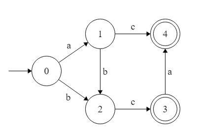
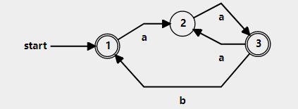
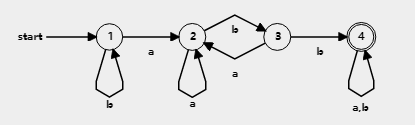

# Discussion 4: Higher Order Programming and NFAs/DFAs

### NOT GRADED

## Questions
__Helper Functions__
```ocaml 
let rec map f xs = match xs with
|[] -> []
|x::xt -> (f x)::(map f xt)

let rec fold_left f a xs = match xs with
|[] -> a
|x::xt -> fold_left f (f a x) xt

let rec fold_right f xs a = match xs with
|[] -> a
|x::xt -> f x (fold_right f xt a)
```
1. What should go in the blank so that the expression evaluates to 2?
```ocaml
let y = (fun x -> x+1) 2 in (_____) y
```

2. What is the this expression type?
```ocaml
(fun x y -> x) 2 3
```
3.  What does this evaluate to?
```ocaml
let f = fun x -> 0 in 
let g = f in 
let h = fun y -> g (y+1) in
h 1
```
4. Fill in the blank so that:
```ocaml
map _____ ["330";"351";"320"] = ["CMSC330";"CMSC351";"CMSC320"]
```
5. What is wrong with this expression?
```ocaml
map (fun x -> x = (x = x mod 9)) [1;2;3;4]
```
6. Fill in the blank so that: 
```ocaml
fold_left (_____) 0 [3;4;16;2;10] = 16
```
7. Fill in the blank so that:
```ocaml
 fold____ (_____) [] [[1;2];[3;4];[5;6]] = [1;2;3;4;5;6]
```
order matters. 

8. Write a function using fold that reverse a list.  Which fold to use?
```ocaml
let reverse lst = 
```
9. Using this modified map function along with fold, calculate the dot product of 2 lists. 
*Example: dot product of [1;2;3] and [1;2;3] is 14 because (1\*1)+(2\*2)+(3\*3)=14*
```ocaml 
let rec map2 f a b = match (a,b) with 
|([],[])->([]) 
|(h1::t1,h2::t2)->(f h1 h2):: (map2 f t1 t2) 
|_->invalid_arg "map2";;

let dotproduct lst1 lst2 =
```
10. Use fold to create a function that takes in a list and makes a palindrome out of it. For example:
```ocaml
palindrome [1;2;3] = [1;2;3;3;2;1]
palindrome ["c";"m";"s";"c"] = ["c";"m";"s";"c";"c";"s";"m";"c"]

let palindrome lst = 
```
which fold to use?

# DFA and Regular Expressions
### Given the following DFAs convert them to their respective regular expressions:
1. 
2. 
3. 


### Draw a DFA for the following regular expressions:
1. `ab(aab)*`
2. `a(b|cde*)`
3. `(a|bb)*m?`


