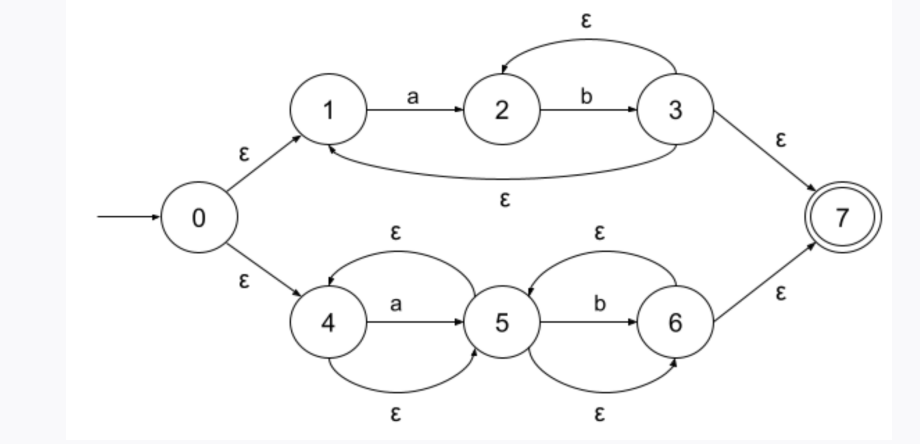
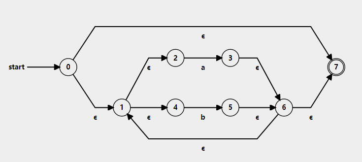
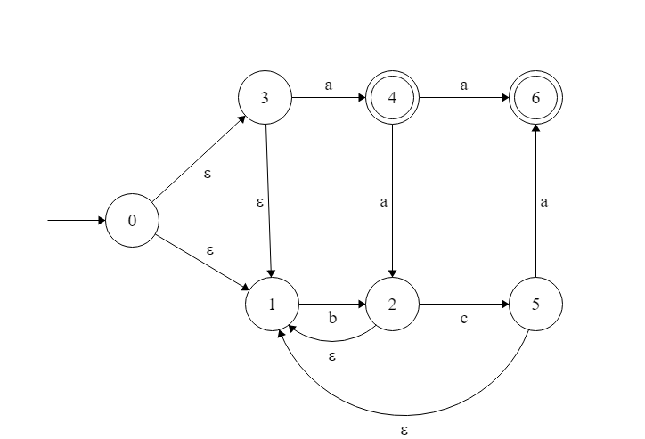

# Discussion 5: NFA to DFA, Regex to NFA, and Quiz!

__NOT GRADED__

## NFA to DFA Exercises
Convert the following NFAs to DFAs using the algorithm and the table method
1. 
2. 
3. 

## Part 3 of Project 3
Code along for part 3 of project 3
```ocaml
let  regexp_to_nfa (regexp : regexp_t) : (int,  char) nfa_t =
```

## 20 minutes for Quiz 2 (Optional)
Choose one:
1. Give 20 minutes for students to do quiz
2. End discussion early and let students do it later
