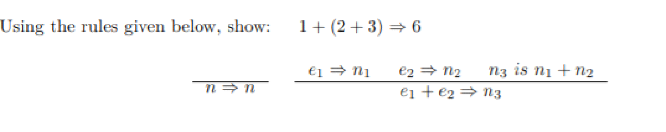
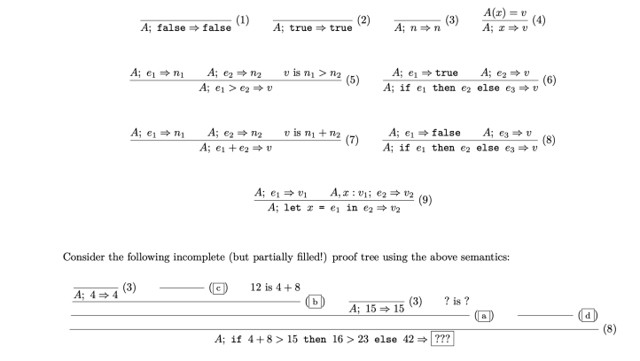
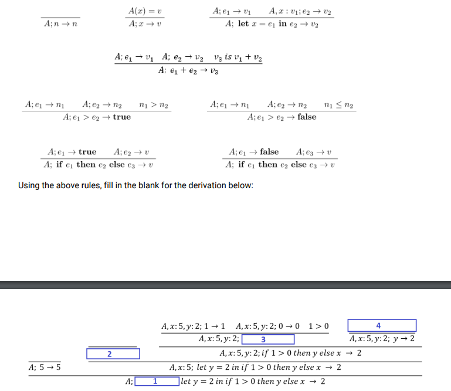

# Discussion 7: Parsing and OpSem
## Getting the Discussion

To download the discussion, go to the cloned repo in your terminal and run  `git pull`. This will download the files for this project and update your cloned repository.

## Submitting

You will submit this the same way you submitted other projects: by running  `gradescope-submit`  in the  `disc7`  folder. If you are unable to get this to work, you can just submit the files in the src/ directory manually to the assignment on Gradescope.
## Parsing Coding Exercise
* To go from source code to a running program, there are 3 steps (at least for our purposes):
    * Tokenizing/Lexing (separating text into smaller tokens)
    * Parsing (generating something meaningful from the tokens - an AST)
    * Interpreting (evaluating the result of the AST) 

* Consider the following grammar:
    * S -> M + S | M
    * M -> N * M | N
    * N -> n | (S)
    * where n is any integer

* This grammar is right associative/recursive (Why did we provide a right associative grammar? What would you do if we didn't?)

* What is the relative precedence of the + and \* operators here? How is it determined? How can we use CFGs to enforce precedence?

### Lexer (We did this last time)
* Variant type `token`
* Maintain an index that keeps track of where we are in the string, and move forward as we keep tokenizing.
* In P4, you will have to worry about the order in which they have their `if/else` ... `if/else` (certain regexs should be checked before others).
* It's probably also a good idea to just define all the regex's and store in variables at the top.

### Parser
* Open `parser.skeleton.ml`.
* Answer key in `parser.ml`
* Variant type `expr` 
* Note: Use `let rec ...` and to write mutually recursive functions.
* Note: `lookahead` just returns the head of the list.
* Note: `match` just "consumes" the head of the list (provided that the token and head of the list match).
* IMPORTANT: 
    * We're going to write a function named `parse_X` for each nonterminal `X` in our grammar.
    * Each of these functions will parse (consume) some tokens, and return (1) the unparsed tokens and (2) the AST which corresponds to the parsed tokens.

### Operation Semantics
#### Whats the point?
- adds meaning to whatever we parse/to evaluate it
- Operational semantic rules has 3 parts
-- Expression
-- Hypothesis

#### Problems
1. 
2. 
3. 

## Quiz #3
20 minutes to do quiz
